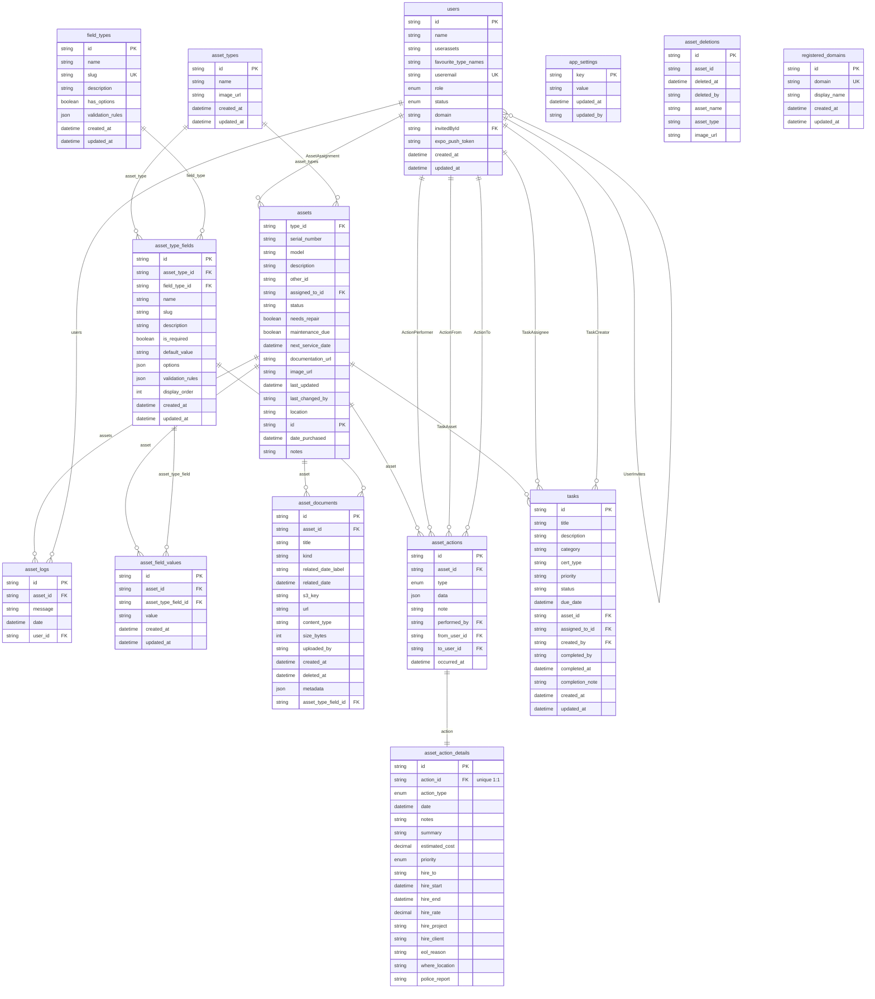

# GearOps — Database ER Diagram

<!-- AUTO-GENERATED from schema.prisma by scripts/generate-erd.js. Do not edit by hand — run `npm run db:erd`. -->

Diagram of the PostgreSQL schema, generated from `schema.prisma`. GitHub, VS Code
(Markdown Preview Mermaid Support), and most Markdown viewers render it natively.

> Legend: `PK` = primary key, `FK` = foreign key, `UK` = unique.
> `||--o{` = one-to-many, `||--||` = one-to-one.

> **Standalone tables** (no foreign-key relations): `app_settings`, `asset_deletions`, `registered_domains`.



## Regenerating

```bash
npm run db:erd        # from inventory-api/
```

It also regenerates automatically on commit when `prisma/schema.prisma` changes
(wired via lint-staged in `package.json`).
